  

 

| Domain                | Stack                                                                                                                                                                                                                                                                                                                                                                                                                                                                                                                                                                                                                                                                                                                                                                      |
| :-------------------- | :------------------------------------------------------------------------------------------------------------------------------------------------------------------------------------------------------------------------------------------------------------------------------------------------------------------------------------------------------------------------------------------------------------------------------------------------------------------------------------------------------------------------------------------------------------------------------------------------------------------------------------------------------------------------------------------------------------------------------------------------------------------------- |
| **Frontend**          |                                                                                                                                                                                                          |
| **Backend & APIs**    |        |
| **Cloud & DevOps**    |                                                                                                                                                                                                                               |
| **AI Tooling & APIs** |                                                                                                                                                                                                                                                                                                                                                                                                                                  |

 

 

